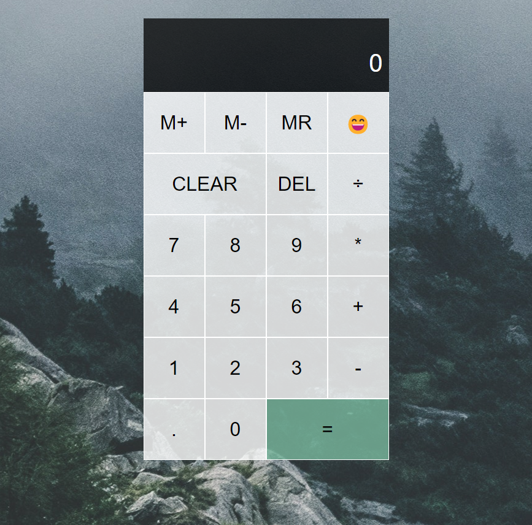

# Forest Calculator
*A calculator with a lovely forest background!*

## Concept
- Create a calculator with JavaScript without using `eval()`.

## Features
- Basic calculator operations using a JavaScript Class
- Ability to clear the calculator display or delete a number digit-by-digit in case of typos
- Memory Save, Memory Clear, and Memory Recall Buttons
- A ~~placeholder~~ cheerful button to explain M+, M-, and MR meanings!

###  Potential Future Development
- Ability to change the operation button (-, \*, +, ÷) once selected
- Use keyboard to input values instead of clicking buttons with a mouse

## Deployed App
[Calculator App](https://marina-russ.github.io/calculator/)

### Application Screenshot

### Credits
Background Image was taken by [LUM3N](https://www.pexels.com/photo/green-leafed-trees-during-fog-time-167684/)
